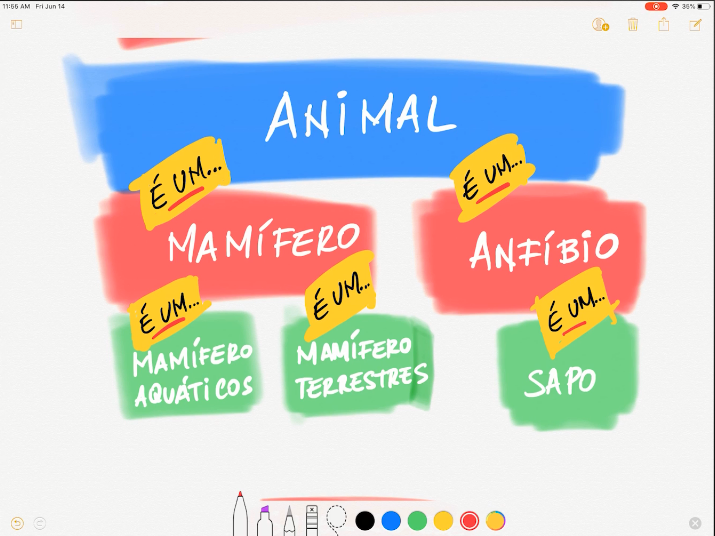
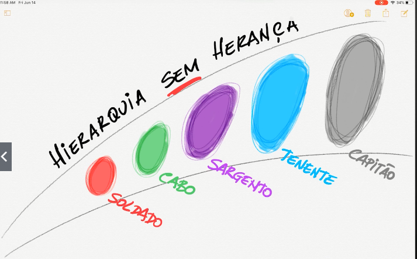

"A orientação a objetos é um paradigma de programação onde os softwares interpretao a vida real."

# Conceitos

## Classe

    - uma classe define é um molde.
        - ex: Cliente é uma classe
    - uma classe contém atributos e metodos
        - atributo é tudo aquilo que define a classe
            - ex: cada pessoa tem uma idade e nome (atributo)
        - metodo é tudo aquilo que a classe executa
            - ex: imprimir nome da pessoa e a idade (metodo)

## Objeto

    - um objeto é a instancia de uma classe
    - para instanciar um objeto voce usa a palavra $variavel = "new" NomeDaClasse()
    - feito isso voce tem uma copia de tudo que tem dentro da Classe de tal forma
    que seja possivel alterar e usar os atributos e metodos da classe atraves desse
    objeto a traves de $variavel->metodo();

## Encapsulamento
    
    - o ato de encapsular é saber o que pode/precisa ser visto publicamente ou apenas interno
    - para definir isso usamos os modificadores de acesso
        - public: pode ser acessado de todos os lugares do codigo que instanciem a classe
        - protected: pode ser acessado dentro da classe e classes de herança
        - private: so pode ser acessado pela propria classe
    - atributos e funções recebem os modificadores

## Herança

    - a herança é baseado em hierarquias é a pergunta é sempre "é um?"
    - a ideia é voce sempre ter uma classe com diversos metodos e atributos
    a partir dessa classe voce ir criando outras classes que tenham isso em comum
    - por exemplo eu poderia ter essa classe

    Class Animal{

        public $respirar;
        public $idade;

        public function respirar(): int{
            if($this->idade < 120>){
                $this->resipirar++;
                return $respirar;
            }
        }

    }
    
    depois uma classe:

    Class Anfibio{
        public $aquatico;

        protected function check(): string
        {
            if($this->aquatico){
                return 'Anfibio';
            }
        }

    }

    - dessa forma anfibio pode herdar de animal mas animal nao herda de anfibio
    pois nem todos os animais sao aquaticos.

    

    - nem sempre hierarquia esta ligado com Herança

    

    - ...

## Polimorfismo

    - php nao tem sobrecarga de metodo (metodos com o mesmo nome)
        - alternativa usar os parametros do construtor com ...
            - function __construct($a, ...) {}
    - php usa tipos dinamicos e nao estaticos
    - polimorfismo é quando voce usa uma superclasse como "Animal"
    em varios objetos, em linguagens tipadas é passado direto na tipagem
    da variavel, em php é passado por uma função.
        - java:
            - int x = 1; // tipagem
            - Animal c = new Anfibio(); // instanciando um objeto anfibio que vai herdar tudo de Animal
            - c = new Mamifero(); // Mudando pra mamifero pq mamifero também é animal
        - php:
            - $x = 1 ?? 'dinamico'; // tipagem
            - function analisar(Animal $bichoEstranho) {...} // passando o parametro como função, 
            assim pode usar como quiser o parametro dentro da função instanciando diversos objetos.

#### Definindo uma classe: atributos, metodos e invocação

    class Cliente {

        // atributos da classe cliente, estão com visibilidade 
        // public ou seja pode ser acessados de varios lugares
        public $nome = 'Anonimo';
        public $idade = 18;

        // um metodo de interação da classe
        public function apresentar(){
            return "Nome: {$this->nome} Idade : {$this->idade} ";
        }

    }

    // nova instancia da classe
    $c1 = new Cliente;

    // setando os elementos da classe
    $c1->nome = 'Raziel';
    $c1->idade = 22;

    //chamando um metodo da classe
    echo $c1->apresentar();

#### Metodos classe: constructor e destructor

    - function __contruct($a,$b,...){}
        - chamada imediatamente com a nova instancia
        - caso o metodo constructor precise de parametros, 
        esses parametrros, deverão ser passados junto com o nee
        ex: $borracheiro = new Pessoa('Alexandre', 20);

    - function __destruct(){}
        - é invocada assim que o objeto é destruido
        ex: unset($borracheiro) ou $borracheiro = null

    class  Pessoa{

        public $nome;
        public $idade;

        // Função que é chamada assim que a instancia é criada
        // se no __construct os parametros forem obrigatorios,
        // será necessarios passar eles diretamente pra instancia
        function __construct(string $vulgo, int $idade = 18)
        {
            // Definindo as variaveis da classe com o parametro vindo da instancia
            $this->nome = $vulgo;
            $this->idade = $idade;

        }

        // Executado quando o objeto é destruido
        function __destruct()
        {
            echo 'Liberado';
        }

        public function apresentar()
        {
            return "Nome: {$this->nome} Idade : {$this->idade} ";
        }

    }

    $borracheiro = new Pessoa("Carlos oliveira", 20);
    echo $borracheiro->apresentar();
    unset($borracheiro);

#### Herança