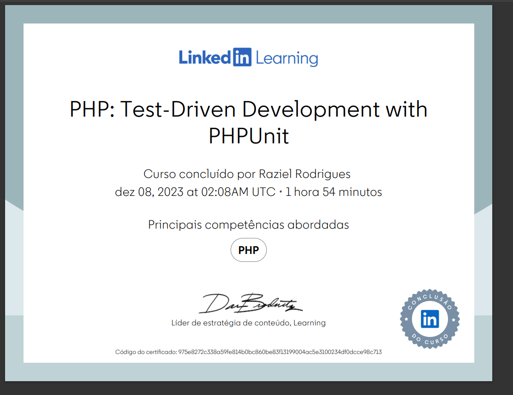
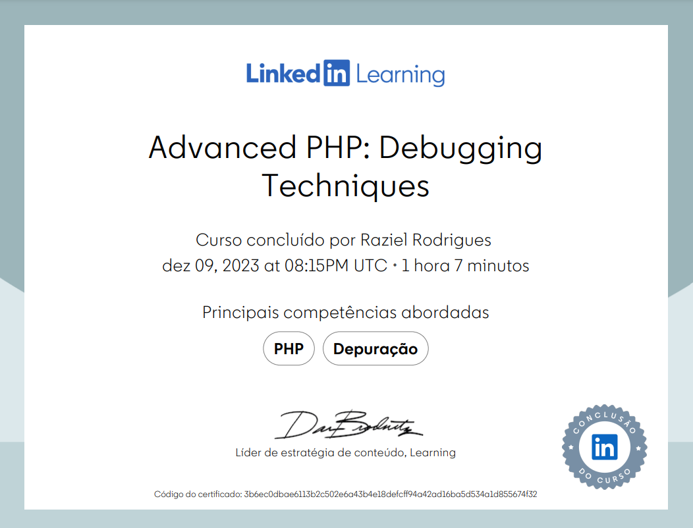
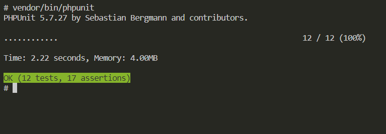

# PHP UNIT STUDIES

PHPUnit is a test runner for PHP with it you can write simple and useful test cases for your code.

# NOTES

- install php unit 
    - composer install phpunit
- create files with test and methods
- run with vendor/bin/phpunit tests
    - here you can filter with --filter="FileTest.php"
    - with data providers: --filter=testTotal#1 (will run the first index)
- adds the phpunit.xml config file
    - configure styles
    - configure testsuits (test a whole file or folder)

# HOW TO TEST

- use assert functions
- use setUp and tearDown for one instance methods
- follow TDD principle: arrange , act and assert 

# TEST DOUBLE

Ability to test your code such as databases without production data or objects those strategy are:
- Dummy: one object that haven't real data
- Fake: a fake class that you need to pass
- Stub: change original function execution
- Spy: See how many times a function were called
- Mock: a fake object for a input

# TECH STACK

- PHP 7.2
- DOCKER
- PHPUNIT
- COMPOSER

# REFERENCES:
- https://www.linkedin.com/learning/php-test-driven-development-with-phpunit
- https://phpunit.de/documentation.html

PHP Test Driven Development
https://www.linkedin.com/learning/certificates/975e8272c338a59fe814b0bc860be83f13199004ac5e3100234df0dcce98c713