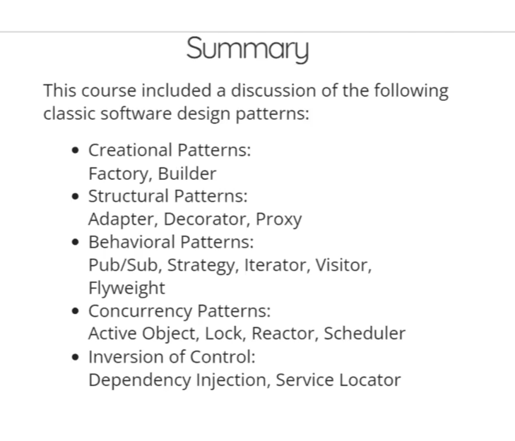
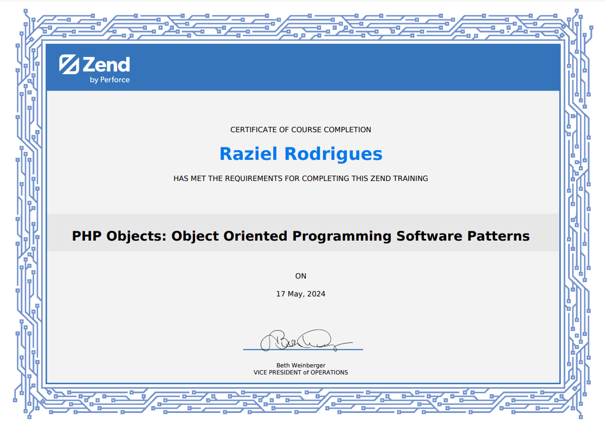

# PHP Objects: Object Oriented Programming Software Patterns

This repository is about my study from the course provided by ZEND, the company behind the PHP runtime
in this course I have learned about the most used patterns of PHP which includes:

I also have written articles about it on my <a href='https://dev.to/razielrodrigues'>dev.to profile</a>

The course is for free and you can also enroll <a href='https://training.zend.com/learn/course/external/view/elearning/316/php-objects-object-oriented-programming-software-patterns
'>clicking here</a>

Plus you get a nice certificate like this one :)

 

git push git@github.com:RazielRodrigues/php-design-patterns-zend.git +new-project:master +site3a:rails3

git remote add repoRemote https://bitbucket/repo/repo1.git